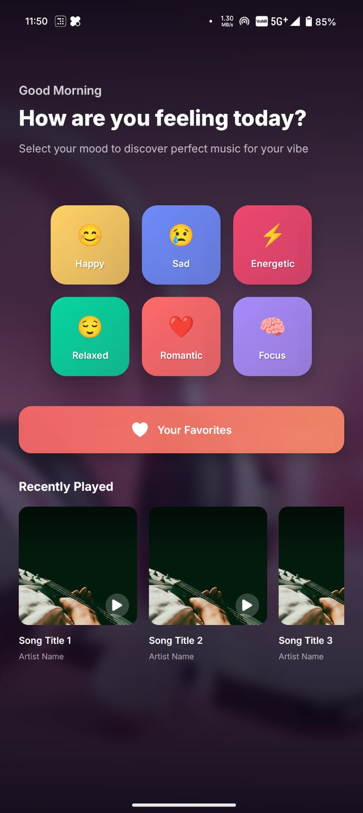
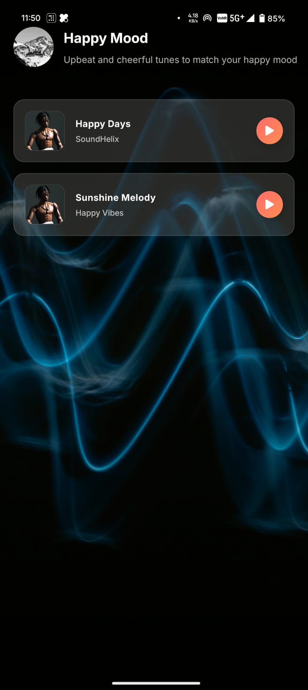
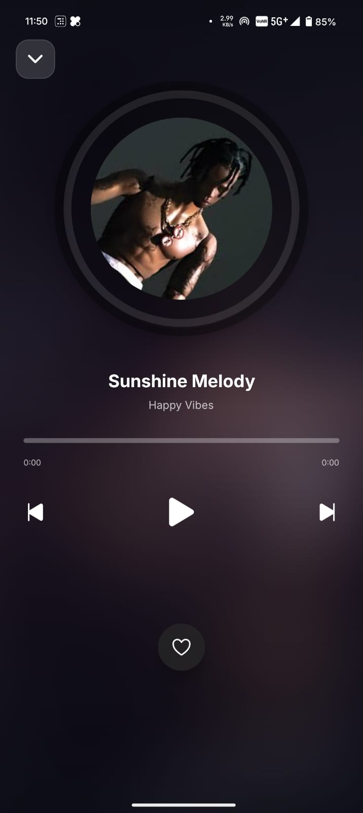

# 🎵 Moodify - Music Mood App

  
_Discover perfect music that matches your current mood_

---

## 📸 Screenshots

| Home Screen                                   | Playlist Screen                                       | Player Screen                                     |
| --------------------------------------------- | ----------------------------------------------------- | ------------------------------------------------- |
|  |  |  |

---

## ✨ Purpose of the App

> Moodify is a music recommendation app that suggests playlists based on your current emotional state. Designed for music lovers who want personalized listening experiences, the app helps users discover music that perfectly matches their mood - whether they're happy, sad, energetic, or relaxed.

---

## 🛠 Tech Stack

- **Frontend**: React Native, Expo
- **State Management**: React Context API
- **Audio Playback**: Expo AV
- **Styling**: React Native StyleSheet + Linear Gradients
- **Navigation**: React Navigation
- **Haptics**: Expo Haptics
- **Persistence**: AsyncStorage

---

## 🤝 Collaborators

| Name              | GitHub                                                | Email                           |
| ----------------- | ----------------------------------------------------- | ------------------------------- |
| [Priyamshu Kumar] | [PriyanshuKumarx](https://github.com/PriyanshuKumarx) | [priyanshukumarx7814@gmail.comgit] |

---

## 📚 What We Learned

- Implementing complex audio playback functionality
- Creating smooth animations in React Native
- Global state management with Context API
- Building responsive layouts for mobile
- Persisting data locally with AsyncStorage
- Handling cross-platform audio challenges
- Creating mood-based recommendation systems

---

## 🚧 Installation & Running Locally

```bash
# Clone the repository
git clone https://github.com/PriyanshuKumarx/Mood_Based_Music_App.git

# Navigate to project directory
cd moodify-music-app

# Install dependencies
npm install

# Start the development server
expo start

# Scan QR code with Expo Go app or run on emulator

Prerequisites
Node.js (v14+)

Expo CLI

Android/iOS simulator or physical device with Expo Go app


🎯 Key Features
Mood-Based Recommendations: Select from 8+ moods to get personalized playlists

Beautiful Player: Animated vinyl-style player with rotating artwork

Favorites System: Save your favorite tracks for quick access

Recently Played: Automatically tracks your listening history

Haptic Feedback: Tactile responses for key interactions

Adaptive UI: Responsive design for all screen sizes


📦 Project Structure

moodify/
├── assets/               # Images and static files
├── components/           # Reusable components
│   ├── MoodSelector.js   # Mood selection interface
│   ├── PlaylistItem.js   # Track listing component
│   └── MusicPlayer.js    # Audio controls
├── constants/            # Data files
│   ├── moods.js          # Mood definitions
│   └── playlists.js      # Track database
├── context/              # State management
│   └── AudioContext.js   # Global audio state
├── navigation/           # App navigation
│   └── AppNavigator.js   # Screen routing
├── screens/              # Main app screens
│   ├── HomeScreen.js     # Mood selection
│   ├── PlaylistScreen.js # Track listing
│   ├── PlayerScreen.js   # Music player
│   └── FavoritesScreen.js# Saved tracks
├── styles/               # Global styles
│   └── globalStyles.js   # Shared styling
└── App.js                # Root component

🚀 Future Enhancements

Social sharing features

Sleep timer functionality

Spotify/Apple Music integration

Dark/light mode toggle


📄 License
This project is licensed under the MIT License - see the LICENSE.md file for details.
```
